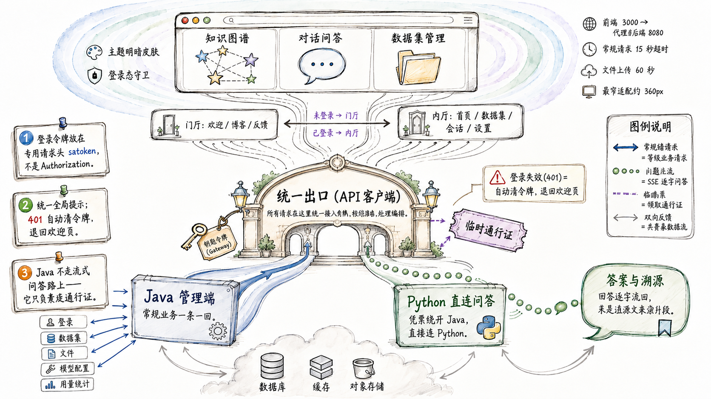

<div align="center">

# LinkRag Web

LinkRag 的 Web 前端 —— 让知识库可视化、可对话、可溯源。

</div>

<p align="center">
  <b>简体中文</b> · <a href="./README_EN.md">English</a>
</p>

<p align="center">
  
  
  
  
  
</p>

<p align="center">
  <a href="http://linkrag.cn/"></a>
</p>

<p align="center">
  
</p>

## LinkRag Web 是什么

LinkRag 是一套企业级 RAG 系统，让任何人都能把文档变成可对话的知识库。本仓库是它的 **Web 前端**，也是用户直接接触的入口：在这里管理数据集与知识文件、用关系图谱可视化文档之间的联系、围绕知识库发起可溯源的 AI 问答。

界面分两类请求落到后端：常规业务（登录、配置、数据集、文件、用量）走 Java 管理端；聊天的检索与生成则由前端凭 Java 签发的短期 token **直连 Python RAG 服务**流式返回——详见下方[系统边界](#系统边界)。

## 功能特性

- **知识图谱可视化** —— 基于 D3 渲染文档间的关系网络，支持交互式探索。
- **知识库问答（RAG）** —— 围绕数据集做检索增强对话，答案逐字流式返回并溯源到来源文件。
- **数据集与知识文件管理** —— 上传、归档、关联文件到指定数据集，跟踪解析状态。
- **多会话对话** —— 持久化的会话列表，首页展示最近对话。
- **LLM 配置中心** —— 在设置中管理多家模型供应商、API Key 与能力开关。
- **用量统计** —— 查看每日 / 汇总的调用用量。
- **响应式与暗色模式** —— 适配桌面与移动端（低至 ~360px），内置主题切换。

## 系统边界

LinkRag 采用「Java 管理端 + Python RAG 执行端」协作模式，本仓库是面向用户的前端，同时与两端打交道。Java 登录返回的同一枚 access token 用于两端：作为 `satoken` 访问 Java，作为 Bearer token 直连 Python 拉逐字流式问答。

- **常规业务**：走统一的 `apiClient`，带 `satoken` 头请求 Java 管理端的 `/api/v1/*`（登录、数据集、文件、模型配置、用量）。
- **聊天召回**：前端把 Java 登录 `accessToken` 作为 `Authorization: Bearer`，直接请求 Python `/api/v1/rag/stream`。Java 不在召回 / 生成请求路径上（实现见 [src/services/recall.ts](src/services/recall.ts)、[src/types/api.ts](src/types/api.ts)）。

## 技术栈

| 类别     | 选型                                    |
| -------- | --------------------------------------- |
| 框架     | React 19 + TypeScript                   |
| 构建     | Vite 6                                  |
| 样式     | Tailwind CSS 4（CSS-first，无 config）  |
| 路由     | React Router 7                          |
| 可视化   | D3                                      |
| Markdown | react-markdown + remark-gfm + rehype    |
| 动画     | Motion                                  |
| 图标     | lucide-react                            |
| 测试     | Vitest + Testing Library                |
| 质量     | ESLint + Prettier + Husky + lint-staged |

## 快速开始

**前置条件：** Node.js 20+，并确保 [LinkRag-Service](https://github.com/ql-link/LinkRag-Service) 后端已在本地 `8080` 端口运行。

```bash
# 1. 安装依赖
npm install

# 2. 启动开发服务器（默认 http://localhost:3000）
npm run dev
```

开发服务器会将 `/api` 请求代理到后端 `http://localhost:8080`（见 [vite.config.ts](vite.config.ts)）。如后端地址不同，按需修改代理目标。

## 常用脚本

| 命令                | 说明                         |
| ------------------- | ---------------------------- |
| `npm run dev`       | 启动开发服务器               |
| `npm run build`     | 生产构建，产物输出到 `dist/` |
| `npm run preview`   | 本地预览构建产物             |
| `npm run lint`      | ESLint 检查（零警告）        |
| `npm run lint:fix`  | ESLint 自动修复              |
| `npm run typecheck` | TypeScript 类型检查          |
| `npm run format`    | Prettier 格式化              |
| `npm run test`      | 运行单元测试                 |

## 目录结构

```text
src/
├── components/   # 通用组件（知识图谱、问答、侧边栏等）
├── contexts/     # 全局状态（Auth / Theme / Toast）
├── layouts/      # 布局（受保护布局、移动导航、右侧面板）
├── pages/        # 页面（home / chats / datasets / settings ...）
├── services/     # API 调用封装（auth / blog / chat / chunk / dataset / llm / oss / recall / user）
├── lib/          # 工具与 API 客户端（api-client.ts）
├── types/        # 类型定义
└── routes.ts     # 路由表
```

## 后端联调

- 服务根地址：`http://{host}:8080`
- 业务接口前缀：`/api/v1`
- 认证请求头：`satoken: {accessToken}`（注意：不是 `Authorization: Bearer`）
- 聊天召回：前端凭 Java 登录 `accessToken` 直连 Python `/api/v1/rag/stream` 拉 SSE（见上方[系统边界](#系统边界)）

更多接口约定见 [docs/ToLink-前端API文档.md](docs/ToLink-前端API文档.md)。

## 环境变量

构建期可注入的 `VITE_` 前缀变量（会被打进静态产物）：

| 变量              | 说明                   |
| ----------------- | ---------------------- |
| `VITE_GITHUB_URL` | 页面中 GitHub 链接地址 |

## 部署

项目通过多阶段 Docker 构建，Nginx 托管 SPA 静态产物：

```bash
# 构建镜像
docker build -t linkrag-web:latest .

# 启动（需提前创建外部网络 tolink-app-net）
TAG=latest docker compose -f deploy/docker-compose.yml up -d
```

CI 流程见 [Jenkinsfile](Jenkinsfile)。

## 分支与发布管理

本仓库与 LinkRag 各端保持一致的分支模型：

- `dev`：日常集成分支，feature/refactor/chore 等日常开发分支通过 PR 合入这里。
- `master`：稳定发布分支，只接受发布 PR 或 hotfix PR，不接受日常分支直接合入。
- `feature/<topic>` / `refactor/<topic>` / `chore/<topic>`：日常开发分支，从 `dev` 拉出并 PR 回 `dev`。
- `release/<version>`：每周发布准备分支，从 `dev` 拉出，通过 release PR 合入 `master`。
- `hotfix/<topic>`：紧急修复分支，从 `master` 拉出，修复后 PR 回 `master`，发布后必须 merge 或 cherry-pick 回 `dev`。

发布规则：

- `dev` → `master` 发布合并必须使用普通 merge commit，禁止 squash merge。
- release PR 合入 `master` 后，在结果 merge commit 上打版本 tag。
- release PR 描述需列出：包含的业务 PR、数据库 / 配置 / 契约变更、测试结果、已知风险。
- CI 或 workflow 的分支过滤如需显式配置，使用 `dev, master`。

## 关联仓库

LinkRag 由三个仓库协作组成：

| 仓库                                                                  | 角色                                                |
| --------------------------------------------------------------------- | --------------------------------------------------- |
| [ql-link/LinkRag](https://github.com/ql-link/LinkRag)                 | Python RAG 服务：文档解析、分片、向量化、索引与召回 |
| [ql-link/LinkRag-Service](https://github.com/ql-link/LinkRag-Service) | Java 管理端：业务编排、任务下发与终态回收           |
| [ql-link/LinkRag-Web](https://github.com/ql-link/LinkRag-Web)（本仓） | 前端：知识库管理与交互界面                          |

## 文档

`docs/` 目录包含前端 API 文档、联调计划、交接文档等，可作为开发与对接参考。

## 许可证

本项目基于 MIT License 开源。
